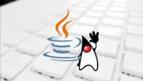

<h1 align="center">
  
</h1>

<h1 align="center">Java COMPLETE Object Oriented Programming + Projects</h1>

## Description

Programming topics include:

- Programming logic and algorithms
- Java language syntax
- Classes, attributes and methods
- Constructors, overloading, encapsulation
- Data structures: arrays and collections
- Enumerations, composition
- Inheritance, polymorphism, interfaces
- Exception Handling
- Generics
- Functional programming and lambda expressions, Stream API
- File manipulation

Main tools and frameworks to work with Java professionally on the market, such as:

- JDBC for SQL-based data access
- JavaFX for GUI
- Git/Github for versioning
- Spring Boot - leading Java framework for commercial Java development
- JPA / Hibernate for data access with object-relational mapping (ORM)
- Maven for managing project dependencies
- Spring Data JPA - framework for ORM data access
- Spring Data MongoDB - framework for accessing NoSQL data to the MongoDB database

### 🛠 Technologies

The following tools were used in the construction of the project:

- [Java](https://www.java.com/pt-BR/)
- [Eclipse](https://www.eclipse.org/)
- [JDBC](https://pt.wikipedia.org/wiki/JDBC)
- [JavaFX](https://openjfx.io/)
- [Git](https://git-scm.com/)
- [Github](https://github.com/)
- [Spring Boot](https://spring.io/projects/spring-boot)
- [JPA](https://pt.wikipedia.org/wiki/Java_Persistence_API)
- [Hibernate](https://hibernate.org/)
- [Maven](https://maven.apache.org/) 
- [Spring Data JPA](https://spring.io/projects/spring-data-jpa)
- [Spring Data MongoDB](https://spring.io/projects/spring-data-mongodb)
